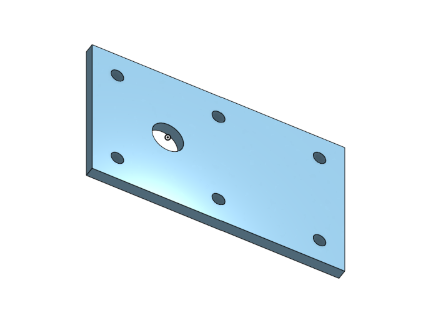
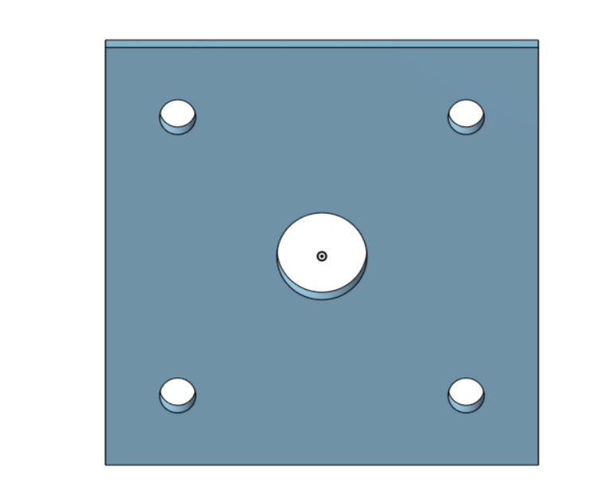
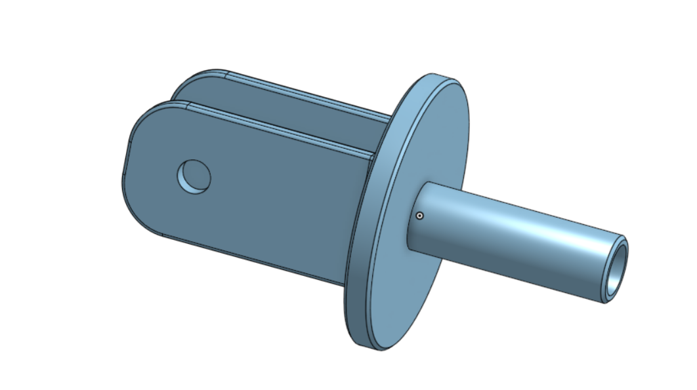
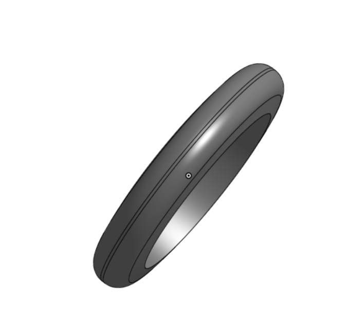
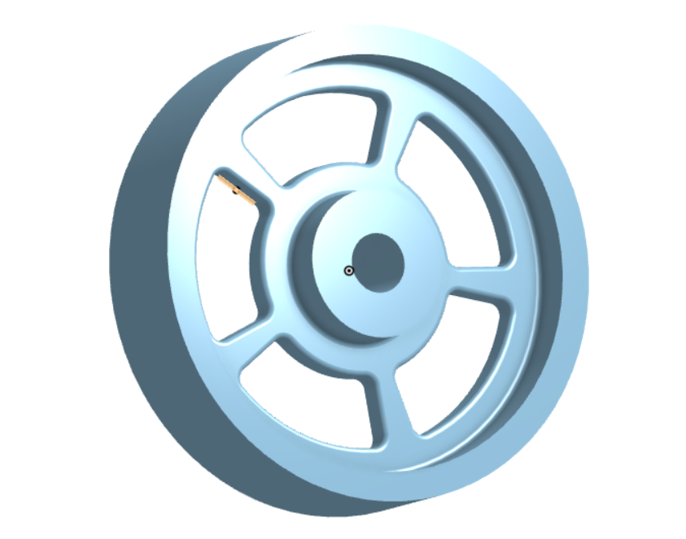
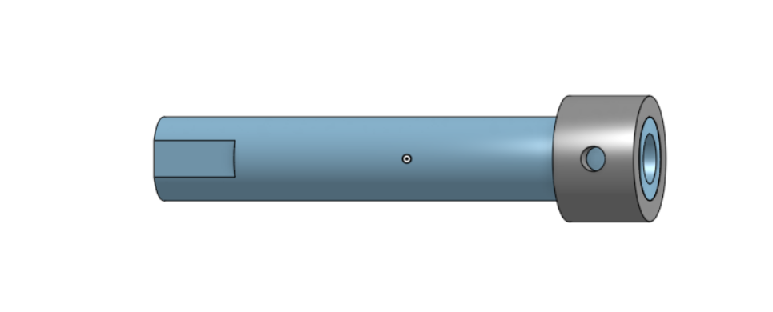
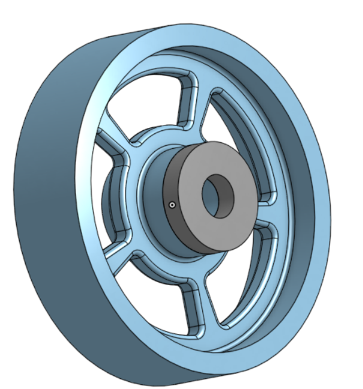
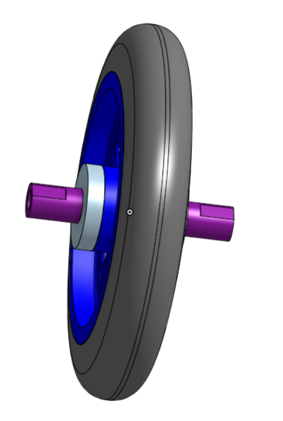
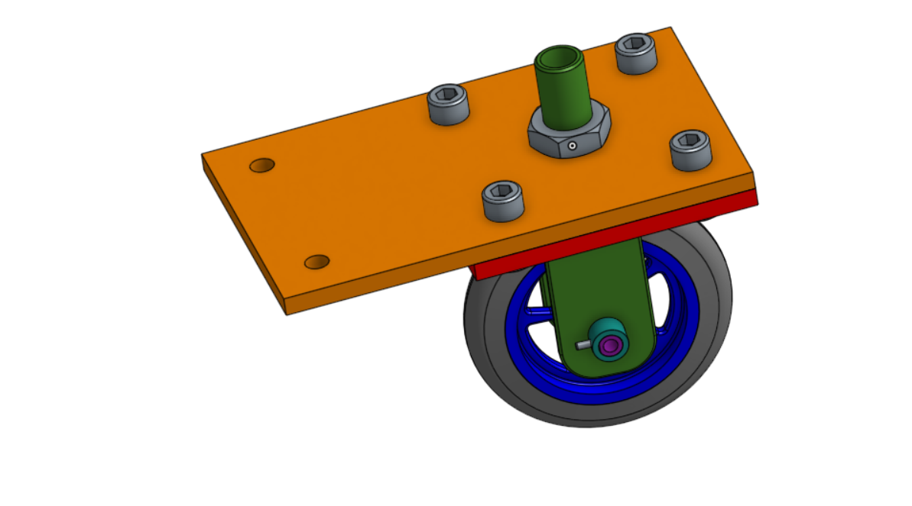

# Basic Onshape CAD
Engineering 4 assignments to learn Onshape, and build a caster.
## Base

### Reflection
In this assignment, I built a base for the caster which is composed of a rectangular plate with 6 small holes and 1 large one. It took a bit of time to get used to the shortcuts and buttons in Onshape, but I can see that when I get comfortable with it, it will be much easier to use than Solidworks.
## Mount

### Reflection
In this assignment, I built a mount for the caster which is a square plate with 4 small holes and 1 large hole. In the future, I might make two separate sketches for the holes and the plate so that I could delete one without messing up the other one.  For now, I've decided to make each piece of the caster its own part studio within one document, but I might start putting multiple parts in one part studio if that proves easier.
## Fork

### Reflection
In this assignment, I built the fork for the caster which will help attach the wheel to the base.  I learned how to do fillets, chamfers, and mirrors in Onshape, which are all very easy to use.
## Tire

### Reflection
In this assignment, I built a tire for the caster, which taught me how to use revolve and how to change color in Onshape.
## Wheel

### Reflection
In this assignment, I built the wheel of the caster in Onshape, and I learned how to circular pattern. Onshape is definitely more intuitive than Solidworks, and it allows you to have more flexibility in what you can extrude or revolve.
## Axle, Collar, and Bearings

.png)
### Reflection
In this assignment, I built 4 simple parts: an axle, a collar on the axle, and 2 bearings which will allow parts to rotate. This taught me how to use the "use" feature on Onshape, which is a unique feature that allows you to build two separate parts in the same part studio.  This is very helpful because it means that the parts' geometry is automatically linked, and you don't have to go back and forth checking the dimensions.
## Wheel Sub-Assembly

### Reflection
In this assignment, I built a subassembly of the caster with the wheel, the tire, the axle, and 2 bearings. I learned how to use fasten and revolute mates, and how to create multiple versions of one document.  Although the video recommended creating a version of each part before I put it into the assembly, because all of my parts are in one document, I was able to create a version of the whole caster document right before I began assembling, so that if I messed up, or modified a part in the assembly, I could easily retrieve the older version.
## Final Caster Assembly

### Reflection
In this assignment, I assembled all of the parts I had made to create the caster (which could go on a shopping cart, or something that needed wheels). I learned how to use parallel mates, and how to insert bolts, nuts, and pins (standard content). I had a little trouble getting the offsets right on the pins in the collar/axle, but I'm finding Onshape very easy to use, as the mates are much simpler when you usually only have to line one set of edges to get what you want, rather than 2 or 3.
